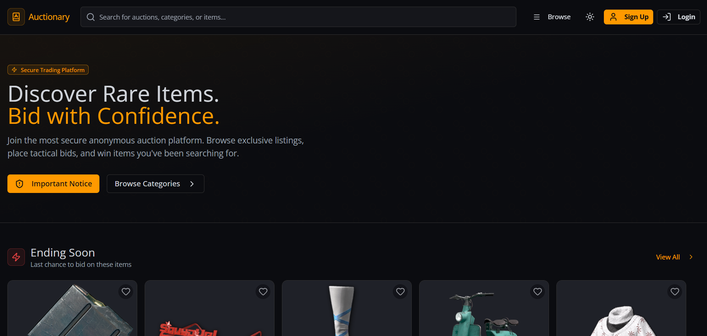
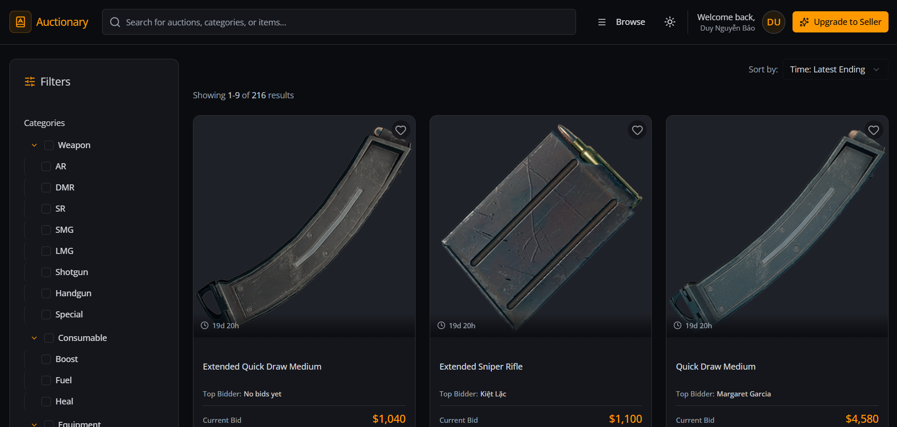
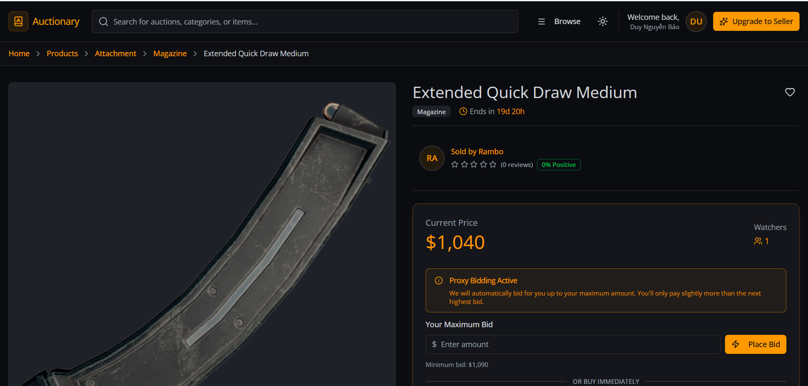
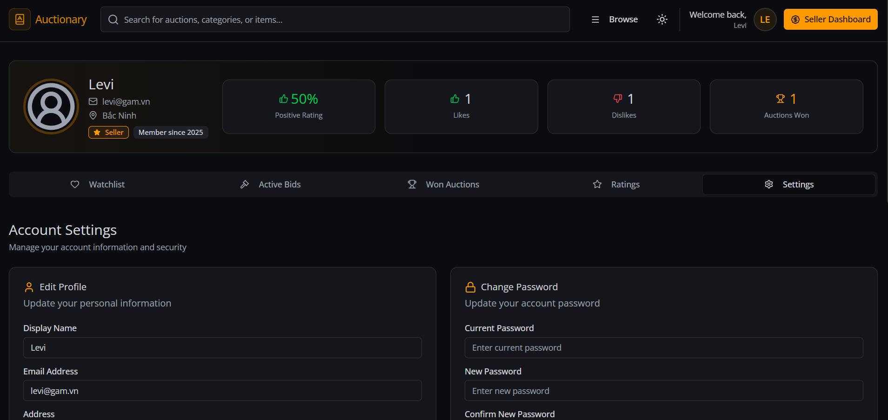
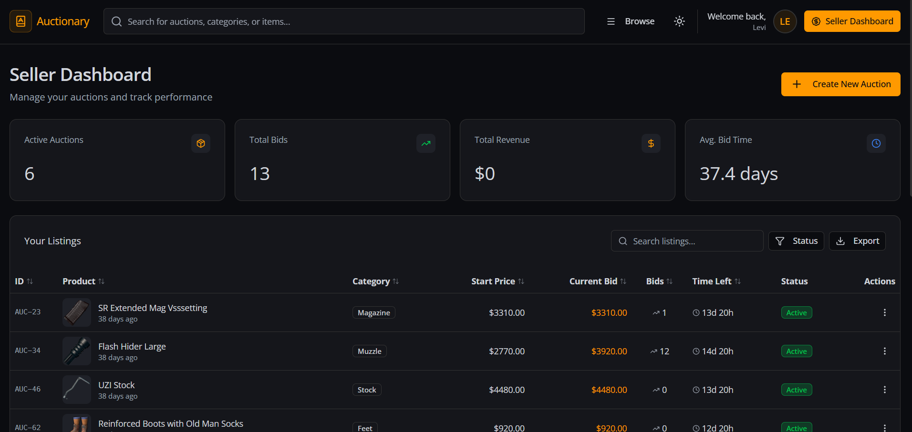

# Auctionary - Online Auction Platform

[](https://reactjs.org/)
[](https://www.typescriptlang.org/)
[](https://nodejs.org/)
[](https://www.postgresql.org/)
[](https://vitejs.dev/)
[](https://tailwindcss.com/)

**Auctionary** is a comprehensive online auction platform that enables users to buy and sell items through a secure and intuitive bidding system. The application provides real-time auction management, user authentication with OAuth support, email notifications, and a modern responsive interface for an engaging auction experience.

This project was developed as part of the **Website ** course at **VNU-HCM University of Science (HCMUS)**, demonstrating practical application of modern full-stack development principles, database design, and software engineering best practices.

---

## Table of Contents

- [Features](#-features)
- [Tech Stack](#-tech-stack)
- [Screenshots](#-screenshots)
- [Getting Started](#-getting-started)

---

## Features

### Guest Features

- **Two-level Category Navigation**: Browse products through hierarchical categories (e.g., Electronics → Mobile Phones)
- **Home Page Highlights**: View top 5 products ending soon, most bids, and highest prices
- **Full-text Search**: Search products by name and/or category with pagination and sorting options
- **Product Details**: View comprehensive product information including images, pricing, seller ratings, and bid history
- **User Registration**: Secure registration with reCAPTCHA verification and email OTP confirmation

### Bidder Features

- **Place Bids**: Bid on products with automatic price validation and step price enforcement
- **Automatic Bidding (Proxy Bidding)**: Set a maximum price and let the system bid automatically on your behalf
- **Watch List**: Save favorite products for quick access
- **Q&A System**: Ask sellers questions about products with email notifications
- **Rating System**: Rate sellers after winning auctions with +1/-1 scores and comments
- **Upgrade Request**: Request account upgrade to become a seller (admin approval required)

### Seller Features

- **Post Auction Products**: Create listings with multiple images, starting price, step price, buy-it-now option, and WYSIWYG descriptions
- **Auto-extend Auctions**: Automatically extend auction time when bids are placed near closing
- **Manage Bids**: Reject problematic bidders (transfers to second-highest bidder)
- **Supplement Descriptions**: Append additional information to product descriptions (preserving history)
- **Answer Questions**: Respond to bidder inquiries with automatic email notifications
- **Rate Winners**: Rate auction winners and cancel transactions for non-payment

### Admin Features

- **Category Management**: Full CRUD operations for two-level category system
- **Product Management**: Monitor and remove auction listings
- **User Management**: Manage users and approve bidder-to-seller upgrade requests
- **System Configuration**: Configure auto-extend parameters and platform settings

### System Features

- **Comprehensive Email Notifications**: Automated emails for bids, rejections, auction endings, Q&A, and more
- **Post-Auction Workflow**: Complete 4-step order process (payment → shipping → delivery → rating)
- **Secure Authentication**: JWT tokens with bcrypt password encryption, Google OAuth, and Facebook OAuth
- **Seller/Bidder Chat**: Built-in messaging for post-auction communication

---

## Tech Stack

### **Frontend**

- **Framework**: React 19.2.3 with TypeScript
- **Build Tool**: Vite 7.3.1
- **Styling**: TailwindCSS 4.1.18
- **UI Components**: Radix UI, Lucide React
- **Routing**: React Router DOM 7.11.0
- **State Management**: React Hooks, Context API
- **Animations**: Framer Motion
- **Notifications**: React Hot Toast, Sonner, React Toastify
- **OAuth**: Google OAuth, Facebook Login

### **Backend**

- **Runtime**: Node.js with Express 5.2.1
- **Language**: TypeScript 5.9.3
- **Database**: PostgreSQL with Supabase
- **ORM**: Knex.js 3.1.0
- **Authentication**: JWT, bcryptjs, Google Auth Library
- **Email Service**: Nodemailer, Resend
- **Validation**: Zod 4.3.5
- **Scheduling**: node-schedule
- **File Upload**: Multer
- **CORS**: Enabled for cross-origin requests

### **Development Tools**

- **Package Manager**: npm
- **Dev Server**: tsx watch (backend), Vite (frontend)
- **Type Checking**: TypeScript strict mode
- **Linting**: ESLint with React plugins
- **Testing**: Jest, Supertest

---

## Screenshots

### Home Page

The landing page features a modern dark theme with a hero section, search functionality, and highlights of products ending soon.



### Product Listings

Browse products with advanced filtering by categories (Weapon, Consumable, etc.) and sorting options. Each listing displays the product image, current bid, top bidder, and time remaining.



### Product Details with Proxy Bidding

Detailed product view showing seller information, current price, and the proxy bidding system where users can set their maximum bid amount.



### Bid History

View the complete auction history with masked bidder names, timestamps, and bid amounts. Similar items are suggested below for easy discovery.


### User Profile

Comprehensive user profile showing rating score, statistics (likes, dislikes, auctions won), and account settings with tabs for watchlist, active bids, won auctions, and ratings.



### Seller Dashboard

Seller control panel displaying key metrics (active auctions, total bids, revenue, average bid time) and a complete listing management table with status tracking.



### Transaction Room

Post-auction workflow featuring a split-view with payment information, receipt upload, and integrated real-time chat between buyer and seller.


---

## Getting Started

### Prerequisites

- Node.js (v18 or higher)
- npm or yarn
- PostgreSQL database (or Supabase account)

### Installation

1. **Clone the repository**

   ```bash
   git clone https://github.com/yourusername/auctionary.git
   cd auctionary
   ```

2. **Backend Setup**

   ```bash
   cd backend
   npm install
   ```

   Copy the provided keys to `.env` file.

3. **Frontend Setup**
   ```bash
   cd frontend
   npm install
   ```
   Copy the provided keys to `.env` file.

### Running the Application

#### Windows (Quick Start)

Run `./run.bat` in the root folder. This starts both backend and frontend.

#### Manual Start

- **Backend**: `cd backend` → `npm run dev`
- **Frontend**: `cd frontend` → `npm run dev`

### Test Accounts

- All accounts are stored in `users_account.csv`
- All accounts have the same password: `Abc12345`
- Admin account: `admin@auction.com` / `Abc12345`
